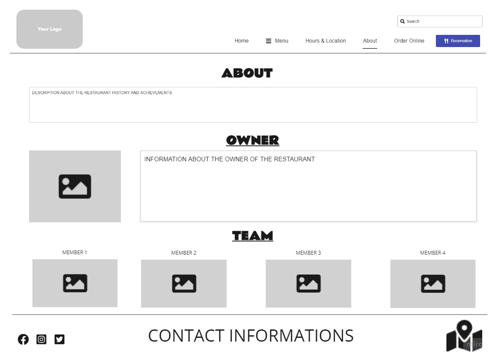

# my-restaurant
A new website project about restaurants

# **Welcome to Valhalla Restaurant**

## Hello Viking! 

We serve a wide range of Italian specialties from various types of pastas to thin crust pizzas to freshly baked homemade breads blazed in a wooden fire oven at **Valhalla!** 

# Menu

- ## Salads /__opt__aboutcom__coeus__resources__content_migration__simply_recipes__uploads__2009__09__caesar-salad-horiz-a-1800-4a465eb53456465091e34138675259c2.jpg)

    - ### Insalata Cesare: 
    *iceberg lettuce, croutons, anchovies, caesar dressing and parmesan cheese*

    - ### Insalata Mista: 
    *iceberg lettuce, rocca, tormatoes, cucumbers, green peppers and Valhalla's dressing*
    
    - ### Insalata Ai Funghi: 
    *iceberg lettuce, tomatoes, mushrooms, corn and Valhalla's dressing*

- ## Pizzas 

    - ### Margherita:
    *Tomato sauce, Mozzarella and Oregano*

    - ### Funghi: 
    *Tomato sauce, Mozzarella, Oregano and Mushrooms*

    - ### Pepperoni: 
    *Tomato sauce, Mozzarella, Oregano and Pepperoni*

    - ### Salami: 
    *Tomato sauce, Mozzarella, Oregano and Salami*

- ## Pastas 

    - ### Spaghetti Bolognese: 
    *Spaghetti with a ground beef and tomato sauce*

    - ### Penne Pesto: 
    *Penne with a Pesto sauce and parmesan cheese*

    - ### Penne Arrabiata: 
    *Penne in a spicy tomato sauce*

    - ### Lasagna Al Ragu: 
    *Layers of pasta with tomato sauce, ground beef, bechamel and Mozzarella*

- ## Pizza Breads 

    - ### Focaccia: 
    *Pizza crust laced with extra virgin olive oil, garlic and rosemary*

    - ### Bianca: 
    *Pizza crust with a hint of extra virgin olive oil and garlic and topped with Mozzarella*

    - ### Marinara: 
    *Pizza crust ropeed with tomato sauce, garlic and oregano*

# For Reservation:

Contact us at +962 00 0000 000 

OR

You can reserve [here](www.vikingsreservefakelink.com) 

# **HOME WIREFRAME IMAGE**

# **ABOUT WIREFRAME IMAGE**

# **ANSWERS TO THE TASK QUESTIONS**

**Q1: What observations or questions do you have about what you’ve learned so far?**

A1: I don't have any questions about HTML so far as I find it easy to manage and could handle it quite good in terms of functionality and coding, yet I still havent learnt styling in CSS but I've searched alot through the weekend on how to display my website as my Wireframe layout but had many difficulties understanding a few things, so hopefully I'll be able to manage it when we take it in the course.

**Q2: How long did it take you to complete this assignment? And, before you started, how long did you think it would take you to complete this assignment?**

A2: It didnt take long to complete the main requirements of the assignement, I believe it took about 2 hours to finish the home and about pages in terms of HTML only with minimum requirements. however, for the styling with CSS as I mentioned before, it took me a while to search and learn about it so it took alot more time to do and still the home page doesnt look so good after what I've done. I thought the whole assignment will take 2-3 hours and so it did.